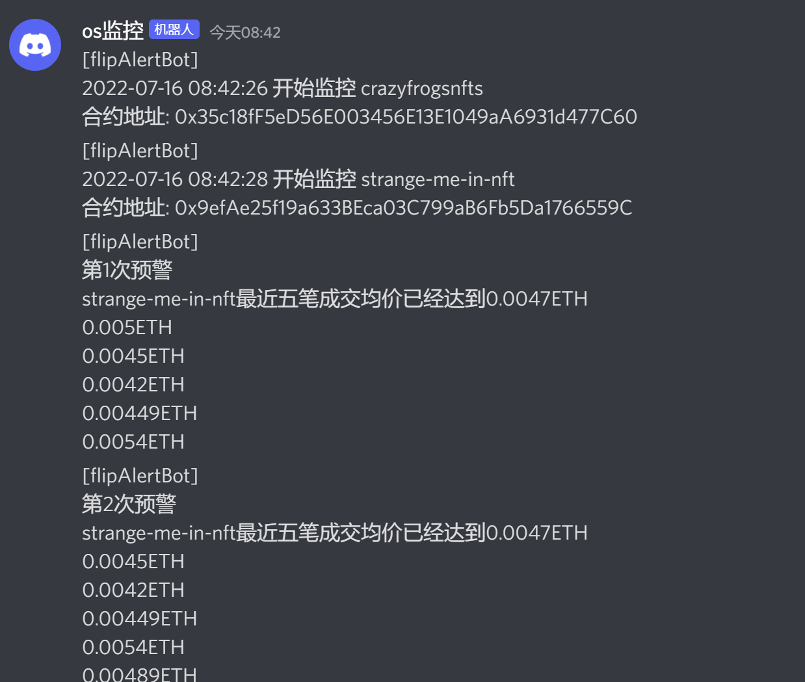

# flipAlertBot
一个OpenSea成交预警通知机器人  

## 配置文件  
### config.js  

`alchemyKey` [注册alchemy](https://alchemy.com/?r=TUwNjExMDY3MzM2M)  
`openseaKey` [此处申请](https://docs.opensea.io/reference/request-an-api-key)  
`discordKey` discord频道-设置-整合-WebHook  
`barkKey` bark软件中的Apikey，仅限苹果设备  
`alertPrice` 首次提醒价格  
`gearsPrice` 阶梯提醒价格档位  
`reactivatePrice` 触发复活提醒价格  
`barkFlag` 否推送到bark  
`dcFlag` 是否推送到discord  

### watch_address.js  

监控的钱包地址，地址出现新增nft后自动开启成交价格监控  

## 部署流程  
1.克隆或下载该项目到本地  
```
git clone https://github.com/luoyeETH/flipAlertBot.git
```
2.切换到对应目录，安装所需依赖包，同时建议安装forever进程管理模块  
```
cd flipAlertBot
npm install
npm install forever -g
```
如果服务器缺少noejs环境，按以下方式配置
```
# 安装nvm
curl -o- https://raw.githubusercontent.com/creationix/nvm/v0.33.2/install.sh | bash  
# 加载nvm配置
source ~/.$(basename $SHELL)rc  
# 安装Node.js
nvm install 16.15.0  
```  
3.按照[配置文件](#配置文件)配置config.js及watch_address.js  

4.运行脚本  
```
node index.js  
# [建议]安装forever后使用以下方式运行脚本
forever start index.js
```

5.停止脚本
```
forever stop index.js
```
> 同时可以直接对指定NFT进行价格监控 
```
node app.js <slug> <alertPrice>
```
实际运行截图  
  

## 参考项目  
[PoorNerd](https://github.com/AeroXi/PoorNerd)  